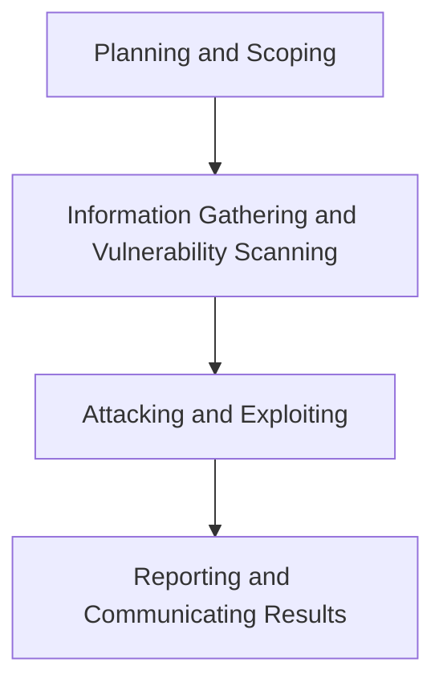

## Cybersecurity Goals
---

![[cia-dad-triad.png | 600]]
*CIA and DAD Triads*

- **Disclosure** attacks seek to gain unauthorized access to information or systems.
- **Alteration** attacks seek to make unauthorized changes to information or systems.
- **Denial** attacks seek to prevent legitimate use of information and systems.

The two models, the CIA and DAD triads, are the cornerstones of cybersecurity. The elements in both models are directly correlated, with each leg of the attackers' DAD triad directly corresponding to a leg of the CIA triad that is designed to counter those attacks. Confidentiality controls seek to prevent disclosure attacks. Integrity controls seek to prevent alteration attacks. Availability controls seek to keep systems running, preventing denial attacks.

## The CompTIA Penetration Testing Process
---
The CompTIA PenTest+ curriculum divides the penetration testing process into four stages:

## The Cyber Kill Chain
---
The CompTIA penetration testing model shown above is an important way for penetration testers to structure their activities. There is an equally important counterpart to this model that describe show sophisticated attackers typically organize their work: the Cyber Kill Chain model. This approach consists of seven stages: 

![[THE-CYBER-KILL-CHAIN-body.png.pc-adaptive.full.medium.png | 600]]
*Cyber Kill Chain model*

![[cyber-kill-chain-comptia-model.PNG | 500]]
*Cyber Kill Chain in the context of the CompTIA model*
